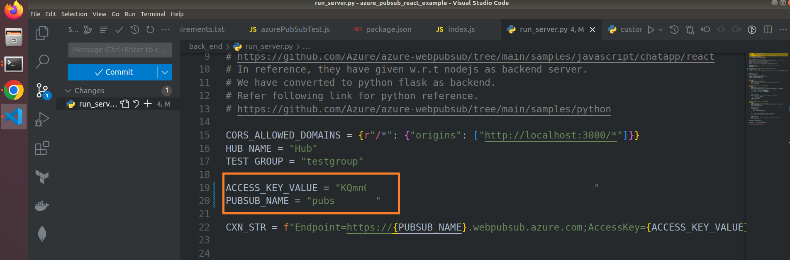
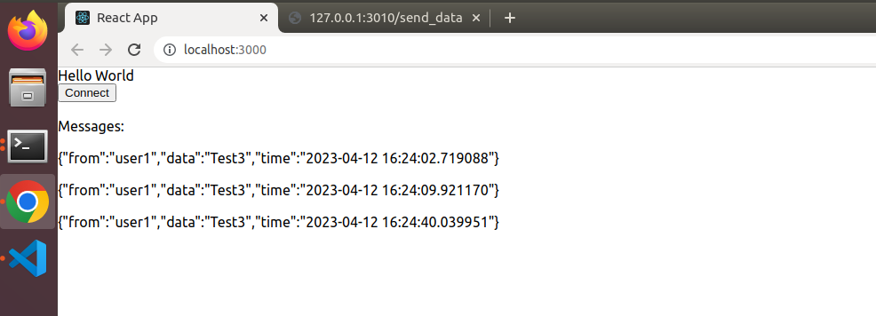
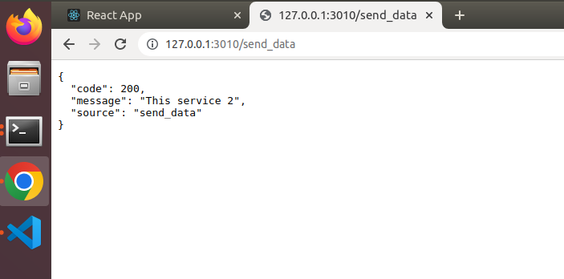
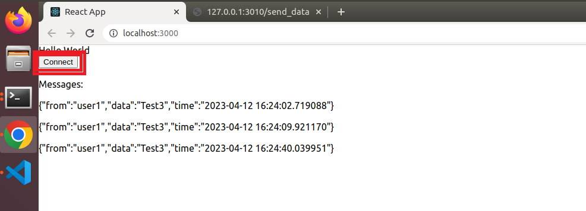

# azure_pubsub_react_example

Checkout the code, and update the name of the pubsub and access key in the code.
Update values correctly in variables

`ACCESS_KEY_VALUE = ""`

`PUBSUB_NAME = ""`

in file `azure_pubsub_react_example/back_end/run_server.py`

To run frontend (React), 
1. Navigate to `front_end/my-app`
2. `npm install`
3. `npm start`

This will run the frontend as shown,

To run backend (python-flask service), 
1. Navigate to `back_end`
2. Activate python virtual environment
3. `pip install -r requirements.txt`
4. Update the correct access keys as shown in the above image
5. `python run_server.py`
6. This will run the flask server in http://127.0.0.1:3010

This will run the backend as shown,

Click `Connect` button in react UI to establish connection.

To send data from backend to frontend, hit the following API
Pass the user_id with correct input value given by user during registering process

`http://127.0.0.1:3010/send_data?user_id=2`

`curl localhost:3010/send_data?user_id=2`
